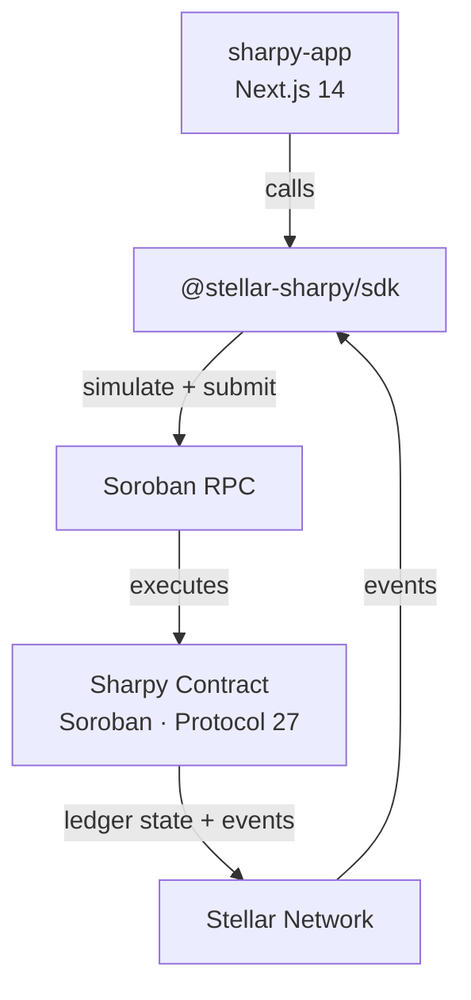

# Sharpy — Advanced Split Payment Contract


Soroban smart contract powering the Sharpy split payment protocol on Stellar. Handles invoice creation, multi-recipient fund distribution, escrow management, recurring billing, and agentic payment integration.


---

## Deployments

| Network | Contract ID | Status |
|---------|-------------|--------|
| Testnet | `CAYTIFPD6RFWVHMK5SPPUUIWWAAANHKOJB6GOAJS5SR5MBKZMEY2UODZ` | ✅ Live |
| Mainnet | Coming soon | ⏳ Pending |

- [Testnet Explorer](https://stellar.expert/explorer/testnet/contract/CAYTIFPD6RFWVHMK5SPPUUIWWAAANHKOJB6GOAJS5SR5MBKZMEY2UODZ)
- [Frontend dApp](https://sharpy-sigma.vercel.app)

---

## Architecture



---

## Features

- **Multi-recipient invoices** — split funds to any number of recipients in one transaction
- **Split rules** — Fixed, Percentage (validated ≤ 100%), Tiered (threshold-based)
- **Multi-token support** — one token per recipient (USDC, XLM, AQUA, yXLM)
- **Recurring/subscription invoices** — auto-generates next invoice on release
- **Escrow protection** — configurable release delay with optional arbitrator
- **Escrow dispute mechanism** — arbitrator can intervene before release
- **Batch invoice creation** — up to 10 invoices in a single transaction
- **Pool payments** — pay multiple invoices across different tokens in one call
- **Structured events** — for all lifecycle actions (created, payment, released, refunded)
- **Invoice stats** — funded/total/completion_bps/unique_payers via `get_invoice_stats`
- **Full audit log** — on-chain audit trail per invoice
- **Admin circuit breaker** — pause/unpause contract
- **Storage TTL auto-extended** — ~1 year on every write

---

## Protocol 25/26 Features

| CAP | Protocol | Feature | Implementation |
|-----|----------|---------|---------------|
| CAP-82 | 26 | Checked 256-bit arithmetic | Overflow-safe split calculations in `_release()` and `get_invoice_stats()` |
| CAP-78 | 26 | Limited TTL extension host functions | `bump_invoice_ttl()` — anyone can extend invoice storage lifetime |
| CAP-75 | 25 | Poseidon/crypto host functions | `get_invoice_fingerprint()` — SHA-256 tamper-evident content hash |

---

## Contract Functions

| Function | Description |
|----------|-------------|
| `initialize(admin, treasury)` | Set admin and treasury addresses |
| `create_invoice(creator, recipients, amounts, tokens, deadline, options)` | Create invoice with split rules and escrow options |
| `create_batch(creator, invoices)` | Create up to 10 invoices in one transaction |
| `create_recurring(creator, recipients, amounts, token, deadline, interval, max)` | Create recurring invoice with auto-generation on release |
| `pay(payer, invoice_id, amount)` | Pay toward an invoice |
| `pool_pay(payer, payments)` | Pay multiple invoices in one call (multi-token) |
| `release_escrow(invoice_id)` | Release escrow-held funds after delay passes |
| `release(invoice_id)` | Manual release for fully funded invoice |
| `refund(invoice_id)` | Refund all payers after deadline passes |
| `cancel_invoice(caller, invoice_id)` | Creator cancels invoice and refunds payments |
| `dispute_release(invoice_id)` | Raise an escrow dispute before release |
| `resolve_dispute(invoice_id, release)` | Arbitrator resolves dispute — release or refund |
| `get_invoice(id)` | Read full invoice state |
| `get_invoice_stats(id)` | Get funded/total/completion_bps/payment_count/unique_payers |
| `get_invoice_fingerprint(id)` | SHA-256 tamper-evident content hash (Protocol 25/26) |
| `get_audit_log(id)` | Full audit trail as Vec<AuditEntry> |
| `get_payer_total(id, payer)` | Total amount paid by a specific address |
| `get_next_recurring(id)` | Next invoice ID in a recurring chain |
| `get_escrow_state(id)` | Current escrow/dispute state |
| `bump_invoice_ttl(id)` | Extend invoice storage TTL to prevent archival (Protocol 26 CAP-78) |
| `pause` / `unpause` | Admin circuit breaker |

---

## Split Rules

| Type | Behaviour | Example |
|------|-----------|---------|
| `Fixed(amount)` | Pay exact amount regardless of funded total | `Fixed(500_000_000)` → always 50 USDC |
| `Percentage(bps)` | Pay `funded * bps / 10_000` (validated ≤ 100%) | `Percentage(6000)` → 60% of funded |
| `Tiered(threshold, bps)` | Pay percentage only if `funded > threshold`, else 0 | `Tiered(100_000_000, 5000)` → 50% if funded > 10 USDC |

---

## Project Structure

```
sharpy-contracts/
├── Cargo.toml                       # Workspace (soroban-sdk 26.1.0)
├── Makefile                         # Build/test/deploy commands
├── CONTRIBUTING.md
├── SECURITY.md
├── CODE_OF_CONDUCT.md
├── CHANGELOG.md
├── contracts/sharpy/
│   ├── Cargo.toml
│   └── src/
│       ├── lib.rs                   # All contract logic (600+ lines)
│       ├── types.rs                 # Invoice, SplitRule, AuditEntry, etc.
│       ├── events.rs                # Structured event helpers
│       └── test.rs                  # 24 unit tests
└── .github/
    ├── workflows/ci.yml             # Test + WASM build on every PR
    └── ISSUE_TEMPLATE/              # Bug report, feature request
```

---

## Build & Test

```bash
make test           # cargo test (24 passing)
make build          # build WASM
make optimize       # optimize WASM with stellar contract optimize
make deploy-testnet # deploy to testnet
make deploy-mainnet # deploy to mainnet
```

---

## Protocol Compatibility

| soroban-sdk | Protocol | Status |
|-------------|----------|--------|
| 26.1.0 | 27 | ✅ Current |

---

## Related Repos

| Repo | Description |
|------|-------------|
| [sharpy-sdk](https://github.com/stellar-sharpy/sharpy-sdk) | TypeScript SDK |
| [sharpy-app](https://github.com/stellar-sharpy/sharpy-app) | Next.js frontend dApp |

---

## Contributing

See [CONTRIBUTING.md](CONTRIBUTING.md) for setup, standards, and commit conventions.

## Security

See [SECURITY.md](SECURITY.md) for the vulnerability disclosure process.

## License

[MIT](LICENSE)
